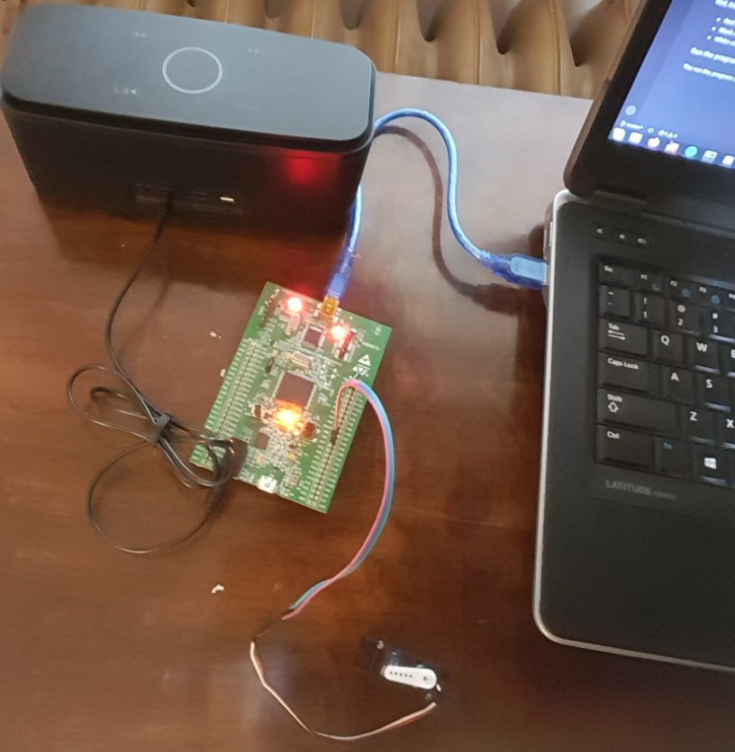

# Coffee Maker

This was an academic project made for Real-Time Systems (COMP 4550) during winter 2020 at the University of Manitoba. This project is the logic of a programable coffee maker. It cannot actually make coffee, it merely simulates the process. It is designed for the STM32F4 Microcontroller unit. This project is based on FreeRTOS, a real-time operating system. This project is designed to be used with the [Keil µVision IDE](http://www2.keil.com/mdk5/uvision/).

This project was developed by [@adamsk34](https://github.com/adamsk34) and [@su-dong](https://github.com/su-dong). All original work introduced by this repository is in the file [Source/main.c](Source/main.c).



## Getting started

Clone the repository using this command:
```
git clone https://github.com/adamsk34/COMP4550-A2.git
```

### Attaching the servo

The servo moves to different positions to dispense each ingredient. The servo we used for this project is the [Micro STD](https://servodatabase.com/servo/gws/micro-std) servo.

Red, black, and white wires from the servo must be connected to the board.
* Red connects to the 5V pin
* Black connects to the GND pin (ground)
* White connects to the PB4 pin

### Attaching the sound unit

Attach a speaker or headphones to the 3.5mm jack for audio output.

### Run the program

The run the program click `build` and `run` from within the µVision IDE.
